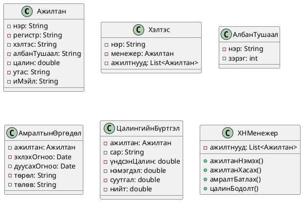

# Хүний нөөцийн удирдлагын мини төслийн тайлан

## Төслийн танилцуулга, гол онцлогууд

Энэхүү мини төсөл нь байгууллагын хүний нөөцийн бүртгэл, удирдлага, ажилтны хөдөлгөөн, цалингийн бүртгэл, амралтын хүсэлт, алдаа зохицуулалт, лог бичлэг зэрэг үндсэн функцуудыг агуулсан программ хангамж юм. Төслийн зорилго нь хүний нөөцийн үйл явцыг автоматжуулах, мэдээллийг шуурхай удирдах, хяналт сайжруулах, багийн хамтын ажиллагааг дэмжихэд оршино.

**Гол онцлогууд:**
- Ажилтны бүртгэл, удирдлага (нэр, регистр, хэлтэс, албан тушаал, цалин, холбоо)
- Ажилд авах, ажлаас гарах, шилжих
- Амралт, чөлөөний хүсэлт, баталгаажуулалт
- Цалингийн бодолт, бүртгэл
- Хэлтэс, албан тушаалын бүтэц
- Алдаа зохицуулалт, лог бичлэг (Log4j v2)
- JUnit тестүүд, TDD зарчим

## Сонгосон төслийн шаардлагын тодорхойлолт

Бидний сонгосон хүний нөөцийн удирдлагын ERP модуль дараах шаардлагуудыг хангасан:
- Ажилтныг бүртгэх, мэдээллийг засах, устгах, жагсаах
- Хэлтэс, албан тушаалын бүтцийг тодорхойлох, ажилтныг хэлтэс/албан тушаалд хуваарилах
- Амралтын хүсэлт гаргах, батлах/татгалзах, түүхийг бүртгэх
- Цалингийн бүртгэл, бодолт хийх
- Хэрэглэгчийн оролт, өгөгдлийн үнэн зөвийг шалгах (алдаа зохицуулалт)
- Лог бичлэгээр үйл явцыг хянах, алдаа, анхааруулгыг бүртгэх
- Багийн хамтын ажиллагааг дэмжих, нэг эх сурвалж дээр хөгжүүлэх боломжтой (GitHub)

## Кодын дизайн, бүтэц (UML-ээр)

Код нь дараах үндсэн классуудтай:
- **Ажилтан** (нэр, регистр, хэлтэс, албан тушаал, цалин, утас, и-мэйл)
- **Хэлтэс** (нэр, менежер, ажилтнууд)
- **АлбанТушаал** (нэр, зэрэг)
- **АмралтынӨргөдөл** (ажилтан, огноо, төрөл, төлөв)
- **ЦалингийнБүртгэл** (ажилтан, сар, цалин, нэмэгдэл, суутгал, нийт)
- **ХНМенежер** (бүх удирдлагын логик, листүүд, лог)

## Сурсан зүйл, бэрхшээл, ирээдүйн сайжруулалт

**Сурсан зүйлс:**  
- ООП зарчим (инкапсуляци, удамшил, полиморфизм)
- Тест бичих, TDD зарчмаар хөгжүүлэх
- Log4j ашиглан лог хийх, алдаа зохицуулах
- GitHub дээр хамтран хөгжүүлэх, branch workflow
- UML-ээр загварчлах

**Бэрхшээлүүд:**  
- Алдаа зохицуулалтыг бүх функцэд тусгах
- Тест, логийг автоматжуулах
- Хэрэглэгчийн оролтын алдааг бүх талаас шалгах

**Ирээдүйд сайжруулах:**  
- Өгөгдлийн сангийн интеграци
- График хэрэглэгчийн интерфейс (UI)
- Вэб эсвэл мобайл хувилбар
- Илүү нарийвчилсан эрхийн менежмент, тайлангийн функцууд

## Кодын баримтжуулалтын тайлбар

- Бүх класс, функцэд Javadoc тайлбар, @param, @return, @throws тайлбарууд нэмсэн.
- Тестийн код болон үндсэн функц бүр дээр ямар зорилготой, ямар нөхцөлд алдаа үүсч болохыг тайлбарласан.
- README болон тайлангийн файлд бүтэц, логик, ажиллах зааврыг дэлгэрэнгүй оруулсан.

---